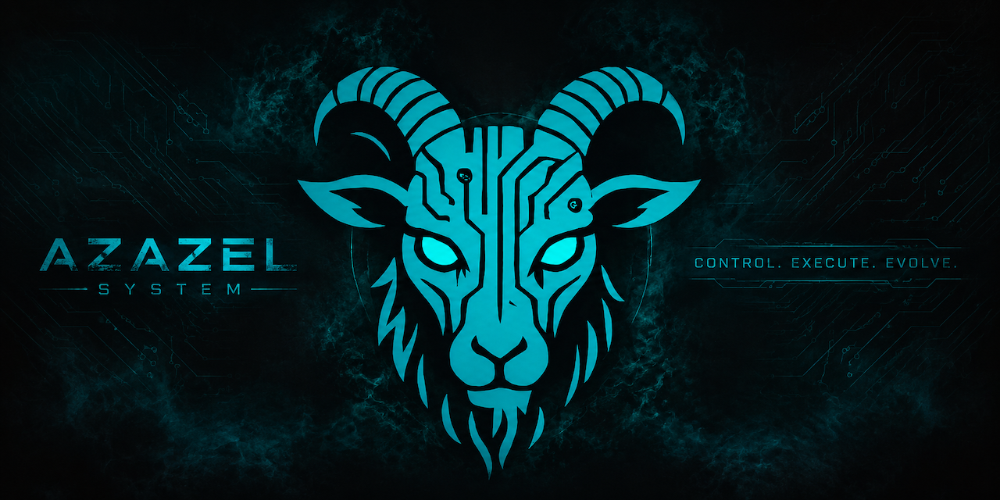

# Azazel-<Form> <Role> - Cyber Scapegoat Gateway

## Development Status

Azazel is a cyber defense doctrine and tool family built around one principle: do not merely block the attacker; bind them, slow them, observe them, and buy time.

It applies delaying action to cyberspace through detection, deterministic decision loops, controlled friction, and selective redirection toward decoys.

## Core Idea: Delaying Action in Cyberspace

In military tactics, delaying action is not passive retreat. It is an intentional operation to shape enemy movement, reduce enemy tempo, and preserve defender initiative.

Azazel translates this into network defense: detect hostile behavior, decide locally, delay attacker progress, and maintain visibility long enough for effective response.

See also: [Delaying Action](docs/philosophy/delaying-action.md) | [Go no Sen](docs/philosophy/go-no-sen.md)

## Why "Scapegoat Gateway"

Azazel can absorb hostile interaction, draw attacker attention away from valuable assets, and redirect suspicious behavior into controlled decoys.

The objective is not retaliation. The objective is control, observability, and time for defenders.

See also: [Cyber Scapegoat Gateway](docs/philosophy/cyber-scapegoat-gateway.md)

## Design Principles

- Local-first and offline-capable operation
- Deterministic decisions before AI assistance
- Gradual response instead of binary allow/block
- Deception and delay with bounded impact on legitimate users
- Deployability on small edge devices
- Auditable defensive actions and mode transitions

See also: [Deterministic Defense](docs/concepts/deterministic-defense.md) | [Offline Edge Defense](docs/concepts/offline-edge-defense.md)

## Tool Family

| Project | Former Name | Role | Target |
|---|---|---|---|
| [Azazel-Edge](https://github.com/01rabbit/Azazel-Edge) | Azazel-Pi | Field-deployable edge SOC/NOC and scapegoat gateway | Raspberry Pi 5 / edge networks |
| [Azazel-Gadget](https://github.com/01rabbit/Azazel-Gadget) | Azazel-Zero | Portable tactical defense on untrusted Wi-Fi | Raspberry Pi Zero 2 W / personal use |
| [Azazel-Grimoire Advisor](https://github.com/01rabbit/Azazel-Grimoire) | Azazel-CTI | Advisory-only tactical CTI node (never commands; edge stays functional if it is absent, slow, or wrong) | Raspberry Pi 4 / on-premises |
| [Azazel-Covenant](https://github.com/01rabbit/Azazel-Covenant) | Azazel-Common | Shared contracts library for the series (common language, not a decision core) | Cross-repository |
| Azazel (this repository) | Legacy doctrine hub | Doctrine, architecture, naming, and product-family entry point | Cross-repository |

Legacy alias mapping: `Azazel-Pi -> Azazel-Edge (formerly)`, `Azazel-Zero -> Azazel-Gadget (formerly)`, `Azazel-USB -> Azazel-Boot (same meaning)`, `Azazel-CTI -> Azazel-Grimoire (formerly, working name)`, `Azazel-Common -> Azazel-Covenant (formerly)`.

Naming rule summary: formal names use `Azazel-<Form> <Role>`, and external presentation should prefer `Azazel-<Form> <Role> - Cyber Scapegoat Gateway`.

## Which Repository Should I Read?

- Start here if you want doctrine, terminology, and architecture framing.
- Read [Azazel-Edge](https://github.com/01rabbit/Azazel-Edge) for edge SOC/NOC gateway implementation.
- Read [Azazel-Gadget](https://github.com/01rabbit/Azazel-Gadget) for personal tactical device implementation.

Azazel is the doctrine. Azazel-Edge and Azazel-Gadget are concrete implementations of that doctrine.

## Documentation Map

- [Philosophy](docs/philosophy/README.md)
- [Concepts](docs/concepts/system-overview.md)
- [Products](docs/products/README.md)
- [Naming and Terminology](docs/specs/naming.md)
- [Existing Architecture Docs](docs/architecture/overview.md)

## Conference / Arsenal Visitor Path

- Arsenal booth, conference profile, or social link
- [Azazel System overview site](https://01rabbit.github.io/Azazel/)
- Doctrine and product selection from this repository
- Implementation deep dive in [Azazel-Edge](https://github.com/01rabbit/Azazel-Edge) or [Azazel-Gadget](https://github.com/01rabbit/Azazel-Gadget)

## Repository Map

- `01rabbit/Azazel`: doctrine, philosophy, naming, and shared architecture
- `01rabbit/Azazel-Edge`: field-deployable edge SOC/NOC gateway implementation
- `01rabbit/Azazel-Gadget`: portable personal tactical defense implementation
- `01rabbit/Azazel-Grimoire` (AZ-04, formerly Azazel-CTI): advisory-only, deterministic on-premises tactical CTI node, `Azazel-Grimoire Advisor`
- `01rabbit/Azazel-Covenant` (AZ-05, formerly Azazel-Common): shared contracts library for the series

## License Matrix

- `01rabbit/Azazel`: Apache-2.0
- `01rabbit/Azazel-Edge`: MIT
- `01rabbit/Azazel-Gadget`: MIT
- `01rabbit/Azazel-Grimoire`: MIT
- `01rabbit/Azazel-Covenant`: TBD
