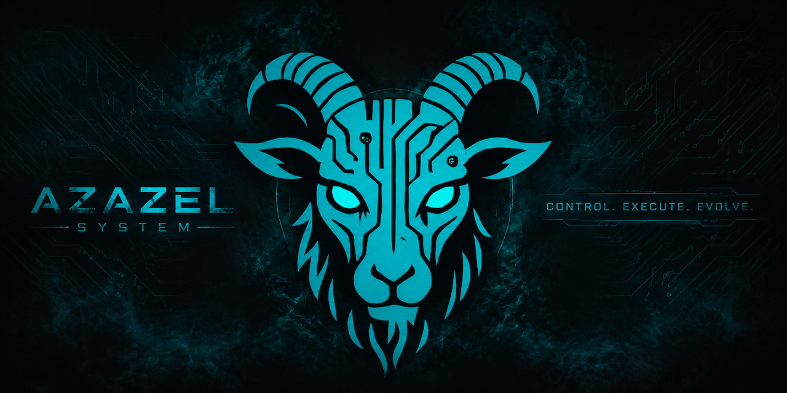

# Azazel-<Form> <Role> - Cyber Scapegoat Gateway

## Development Status

Azazel is a cyber defense doctrine and tool family built around one principle: do not merely block the attacker; bind them, slow them, observe them, and buy time.

It applies delaying action to cyberspace through detection, deterministic decision loops, controlled friction, selective redirection, bounded deception environments, and evidence-backed observation.

## Core Idea: Delaying Action in Cyberspace

In military tactics, delaying action is not passive retreat. It is an intentional operation to shape enemy movement, reduce enemy tempo, and preserve defender initiative.

Azazel translates this into network defense: detect hostile behavior, decide locally, delay attacker progress, redirect or channel when policy allows, and maintain visibility long enough for effective response.

See also: [Delaying Action](docs/philosophy/delaying-action.md) | [Go no Sen](docs/philosophy/go-no-sen.md)

## Why "Scapegoat Gateway"

Azazel can absorb hostile interaction, draw attacker attention away from valuable assets, and redirect suspicious behavior into controlled decoys or coherent deception environments.

The objective is not retaliation. The objective is control, observability, and time for defenders.

See also: [Cyber Scapegoat Gateway](docs/philosophy/cyber-scapegoat-gateway.md)

## Design Principles

- Local-first and offline-capable operation
- Deterministic decisions before AI assistance
- Gradual response instead of binary allow/block
- Deception and delay with bounded impact on legitimate users
- Hardware-aware but portable deployment
- Auditable defensive actions and mode transitions
- Explicit authority separation among decision, contract, knowledge, and deception execution planes

See also: [Deterministic Defense](docs/concepts/deterministic-defense.md) | [Offline Edge Defense](docs/concepts/offline-edge-defense.md)

## Tool Family

| Project | Designation | Codename | Former Name | Role | Target |
|---|---|---|---|---|---|
| [Azazel-Edge Gateway](https://github.com/01rabbit/Azazel-Edge) | AZ-01 | `SENTINEL` | Azazel-Pi | Field-deployable edge SOC/NOC and scapegoat gateway; final deterministic engagement authority | Raspberry Pi 5 / edge networks |
| [Azazel-Gadget Shield](https://github.com/01rabbit/Azazel-Gadget) | AZ-02 | `TACMOD` | Azazel-Zero | Portable tactical defense on untrusted Wi-Fi; fixed Engage-lite profiles only | Raspberry Pi Zero 2 W / personal use |
| Azazel-Boot Probe | AZ-03 | — | Azazel-USB | Reserved bootable rapid-response class; no repository yet | Portable USB boot |
| [Azazel-Knowledge Advisor](https://github.com/01rabbit/Azazel-Knowledge) | AZ-04 | `GRIMOIRE` | Azazel-CTI | Advisory-only tactical CTI / Behavioral CTI node; never commands | Raspberry Pi 4 / on-premises |
| [Azazel-Fabric Contract](https://github.com/01rabbit/Azazel-Fabric) | AZ-05 | `COVENANT` | Azazel-Common | Shared contracts library — the series' common language, never a decision core | Cross-repository |
| [Azazel-Deception Host](https://github.com/01rabbit/Azazel-Deception) | AZ-06 | `THEATRE` | — | Container-first Engagement Environment Plane; materializes, transitions, records, and resets Edge-approved deception environments | Pi 5 minimum reference / ARM64 / AMD64 / x86 scaling |
| Azazel (this repository) | — | — | — | Doctrine, architecture, naming, and product-family entry point | Cross-repository |

Edge, Gadget, and Boot are defensive deployment classes. Deception is the attacker-facing engagement-environment execution class. Fabric and Knowledge are support classes.

The responsibility rule is:

> Engage expresses intent. Knowledge advises. Fabric describes. Edge decides and enforces. Deception Host materializes, transitions, records, and resets.

Legacy alias mapping: `Azazel-Pi -> Azazel-Edge (formerly)`, `Azazel-Zero -> Azazel-Gadget (formerly)`, `Azazel-USB -> Azazel-Boot (same meaning)`, `Azazel-CTI -> Azazel-Knowledge (formerly, working name)`, `Azazel-Common -> Azazel-Fabric (formerly)`.

Naming rule summary: formal names use `Azazel-<Form> <Role>`. `Azazel-Deception Host` / AZ-06 / `THEATRE` were ratified on 2026-08-13 after creation of the implementation repository.

## Which Repository Should I Read?

- Start here for doctrine, terminology, naming, responsibility boundaries, and architecture framing.
- Read [Azazel-Edge](https://github.com/01rabbit/Azazel-Edge) for edge SOC/NOC gateway implementation and deterministic engagement authority.
- Read [Azazel-Gadget](https://github.com/01rabbit/Azazel-Gadget) for portable personal tactical defense.
- Read [Azazel-Knowledge](https://github.com/01rabbit/Azazel-Knowledge) for advisory-only Tactical/Behavioral CTI.
- Read [Azazel-Fabric](https://github.com/01rabbit/Azazel-Fabric) for shared series contracts and interoperability.
- Read [Azazel-Deception](https://github.com/01rabbit/Azazel-Deception) for the container-first deception-environment runtime, reference packages, host capability model, lifecycle, evidence, and reset implementation.

## AZ-06: Engagement Environment Plane

Azazel-Deception Host is not a second arbiter and not a generic autonomous honeypot controller. It receives an approved package/decision boundary, validates local capabilities, materializes the environment through a runtime adapter, records interaction evidence, and performs deterministic termination/reset.

Initial bootstrap scope:

- OCI container baseline
- ARM64 and AMD64
- Docker Compose reference adapter
- static Linux reference package
- host capability discovery
- fail-closed package validation
- non-executing deterministic placement plan
- live activation disabled until Fabric and Edge integration gates are complete

Detailed design: [AZ-06 Container-First Architecture](docs/concepts/azazel-deception-host-container-first.md).

## Documentation Map

- [Philosophy](docs/philosophy/README.md)
- [Concepts](docs/concepts/system-overview.md)
- [AZ-06 Container-First Architecture](docs/concepts/azazel-deception-host-container-first.md)
- [Products](docs/products/README.md)
- [Product Map](docs/products/product-map.md)
- [Naming and Terminology](docs/specs/naming.md)
- [Existing Architecture Docs](docs/architecture/overview.md)
- [Contributing](CONTRIBUTING.md)
- [Security Policy](SECURITY.md)

## Conference / Arsenal Visitor Path

- Arsenal booth, conference profile, or social link
- [Azazel System overview site](https://01rabbit.github.io/Azazel/)
- Doctrine and product selection from this repository
- Implementation deep dive in the product repository matching the deployment role

## Repository Map

- `01rabbit/Azazel`: doctrine, philosophy, naming, and shared architecture
- `01rabbit/Azazel-Edge`: field-deployable edge SOC/NOC gateway and deterministic decision authority
- `01rabbit/Azazel-Gadget`: portable personal tactical defense implementation
- `01rabbit/Azazel-Knowledge`: advisory-only on-premises Tactical/Behavioral CTI node, AZ-04
- `01rabbit/Azazel-Fabric`: shared contracts and interoperability foundation, AZ-05
- `01rabbit/Azazel-Deception`: container-first Engagement Environment Plane, AZ-06

## License Matrix

- `01rabbit/Azazel`: Apache-2.0
- `01rabbit/Azazel-Edge`: MIT
- `01rabbit/Azazel-Gadget`: MIT
- `01rabbit/Azazel-Knowledge`: MIT
- `01rabbit/Azazel-Fabric`: MIT
- `01rabbit/Azazel-Deception`: MIT
