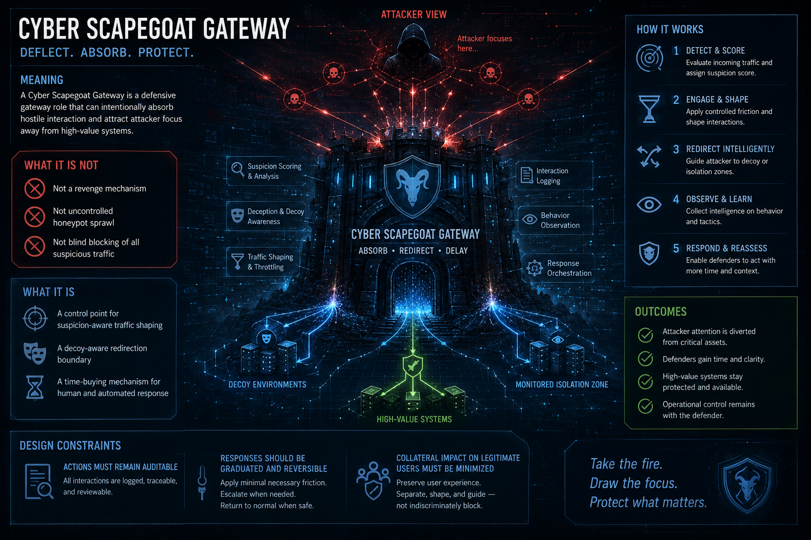

# Cyber Scapegoat Gateway

Back to: [Philosophy Index](README.md) | Related: [Product Map](../products/product-map.md)

## Meaning

A Cyber Scapegoat Gateway is a defensive gateway role that can intentionally absorb hostile interaction and attract attacker focus away from high-value systems.

## What It Is Not

- Not a revenge mechanism
- Not uncontrolled honeypot sprawl
- Not blind blocking of all suspicious traffic

## What It Is

- A control point for suspicion-aware traffic shaping
- A decoy-aware redirection boundary
- A time-buying mechanism for human and automated response

## Design Constraints

- Actions must remain auditable
- Responses should be graduated and reversible
- Collateral impact on legitimate users must be minimized

See also: [Offline Edge Defense](../concepts/offline-edge-defense.md) | [Azazel-Gadget](../products/azazel-gadget.md)
