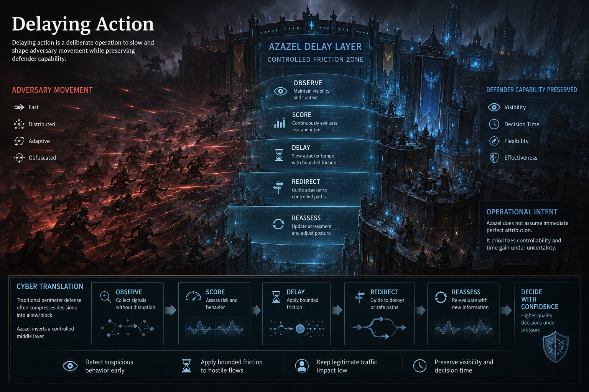

# Delaying Action

Back to: [Philosophy Index](README.md) | Related: [Deception and Delay](../concepts/deception-and-delay.md)

## Definition

Delaying action is a deliberate operation to slow and shape adversary movement while preserving defender capability.

In Azazel, this means:

- Detect suspicious behavior early
- Apply bounded friction to hostile flows
- Keep legitimate traffic impact low
- Preserve visibility and decision time

## Cyber Translation

Traditional perimeter defense often compresses decisions into allow/block. Azazel inserts a controlled middle layer:

- Observe
- Score
- Delay
- Redirect when needed
- Reassess

This increases defender decision quality under pressure and reduces attacker tempo.

## Operational Intent

Azazel does not assume immediate perfect attribution. It prioritizes controllability and time gain under uncertainty.

See also: [Deterministic Defense](../concepts/deterministic-defense.md) | [Azazel-Edge](../products/azazel-edge.md)
