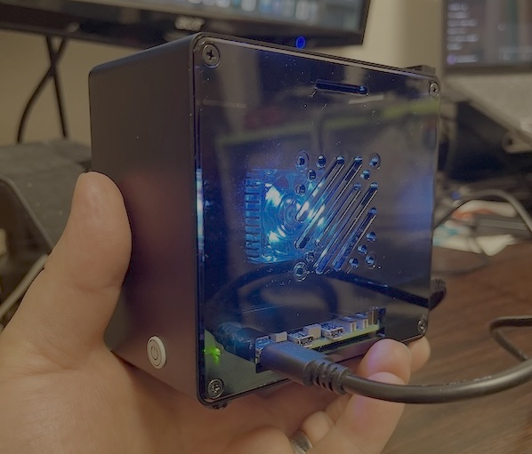

# Azazel-Pi (AZ-01)

Raspberry Pi 5 baseline.  
Focus: shelter SOC/NOC, Vector aggregation, Mattermost notifier, nftables/tc templates.

[→ View the full repository on GitHub](https://github.com/01rabbit/Azazel-Pi)

