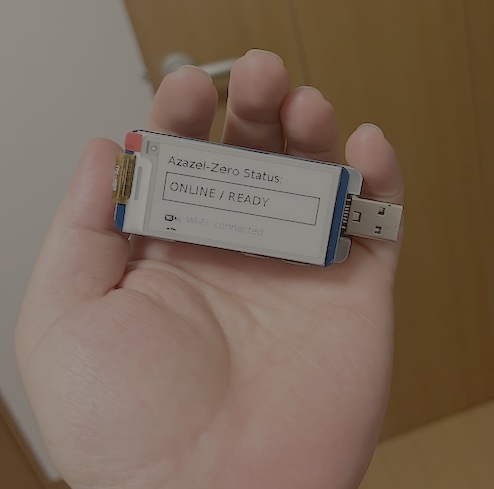

# Azazel-Zero (AZ-02)

Raspberry Pi Zero 2 W baseline.  
Focus: laptop surrogate gateway, e-paper UI, minimal Suricata/OpenCanary, gadget-mode options.

[→ View the full repository on GitHub](https://github.com/01rabbit/Azazel-Zero)

